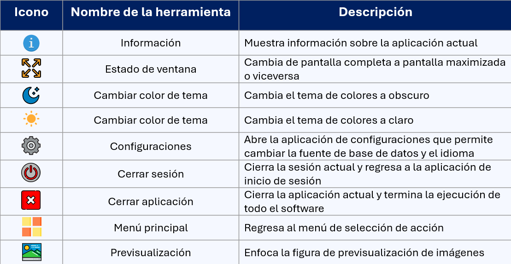

# PACS

## Barra de herramientas 
Todas las aplicaciones cuentan con una barra de herramientas que le permiten al usuario acceder a distintas funcionalidades. Todas las herramientas se muestran en la siguiente imagen, no obstante, cada aplicación puede presentar un conjunto diferente aunque todas pertenecientes a las siguientes.

 
Todas las herramientas, nombres y funcionalidades se describen en la siguiente tabla:

 

 

## Aplicación de inicio de sesión
__Funciones:__

1. Controlar inicio de sesión.
2. Validar datos.
3. Detectar tipo inicio de sesión.
4. Conectar con la base de datos.

## Aplicación de administración de usuarios

__Funciones:__

1. Crear inicios de sesión y asignar rol de administrador.
2. Mostrar inicios de sesión.
3. Habilitar y deshabilitar inicios de sesión.
4. Eliminar inicios de sesión.
5. Modificar credenciales.

## Aplicación de busqueda de registros
__Funciones:__

1. Mostrar expedientes registrados.
2. Filtrar ID de expedientes.
3. Autocompletar ID de expedientes.
4. Consultar expedientes.

## Aplicaciones de creación y visualización de expediente clínico electrónico
__Funciones:__

1. Recolectar información para el expediente clínico.
2. Validar información.
3. Validar formato de estudios de imagen.
4. Previsualizar estudios de imagen.
5. Crear expediente clínico y asignarle un ID.
6. Cifrar expediente clínico.
7. Almacenar expediente clínico en la base de datos.
8. Visualizar expediente clínico.
9. Modificar estudios de imagen.

